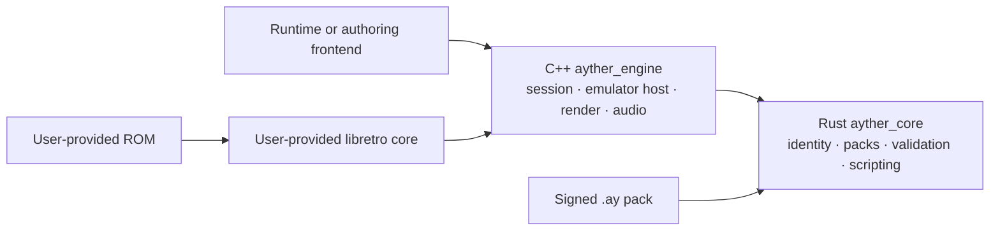

# AYTHER Engine


AYTHER Engine is the open-source runtime technology behind real-time audiovisual
remastering for retro 2D games. It observes graphics, memory, and sound produced
by an emulator, derives deterministic identities, and resolves those identities
to replacement assets stored in a separate `.ay` content pack. The original ROM
is not modified or redistributed.

> [!WARNING]
> **Early-development software.** This repository has not published a stable
> release. The Rust core, C ABI, native C++ engine, installable CMake package,
> explicit pack trust policy, and reproducible pre-release automation are
> present, but broader renderer/audio oracles and operational Hub keys remain.
> Do not treat the current
> API, ABI, file format, or security model as a production commitment.

## Current repository status

| Area | Status in this checkout | Evidence |
|---|---|---|
| `ayther_core` Rust library | Implemented | `core/`; 360 unit tests pass and one benchmark is ignored |
| Typed Rust/C++ bridge | Implemented on the Rust side | `core/src/ffi.rs`; generated through `cxx` |
| Legacy flat C ABI | Implemented, unstable | `core/src/lib.rs`; independent ABI revision currently returns `7` |
| `.ay` pack VFS, validation, and signing | Production policy implemented | Manifest schema `2`; explicit scoped/expiring/revocable public-key registry; optimized builds reject the RFC test key |
| C++ `ayther_engine` | Buildable, pre-release | `Ayther::engine` declares all 24 sources and links the manifest-mode SDL3/Vulkan stack, core, and ymfm |
| C++/ABI/integration tests | Partial | One headless C++ ABI test is present; renderer, audio, and full integration suites are pending |
| Installable SDK surface | Pre-release | `find_package(Ayther)` exposes `Ayther::core`, `Ayther::engine`, and `Ayther::ymfm`; VPX builds also expose `Ayther::vpx` |
| Stable release | Not available | Reproducible signed pre-releases are automated; native, hardware, fixture, operational-key, and review gates stay open |

The authoritative, date-stamped assessment is in
[Project status](docs/PROJECT_STATUS.md). It deliberately distinguishes working
code from specified but unavailable components and planned development work.

## Architecture at a glance

AYTHER Engine is designed as two tightly coupled implementation layers shipped
from one repository:



`ayther_core` and the C++ engine have verified CMake targets and install
contracts on Windows. See
[Architecture](docs/ARCHITECTURE.md) for the data flow, module map, trust
boundaries, and ownership rules.

## What the Rust core provides

- deterministic tile, sprite, pose, animation, background, and audio identities;
- conditional HD substitution and RAM-anchored entity matching;
- `.ay` archive loading, manifest/schema checks, integrity verification,
  regional overlays, resolution tiers, and ranged reads;
- structured pack compatibility and authorship findings;
- a constrained Lua 5.4 environment with a per-frame instruction budget;
- in-memory IPS/BPS patch application, without modifying the source ROM;
- SoundFont normalization, trimming, synthesis, and instrument mapping;
- a typed `cxx` bridge plus an older pointer-based C ABI.

Detailed ownership is documented in [Core module reference](docs/ARCHITECTURE.md#core-module-map).

## Build and test what exists today

Install the pinned Rust toolchain from `rust-toolchain.toml`, then run:

```text
cargo fmt --all -- --check
cargo clippy --workspace --all-targets --locked -- -D warnings
cargo test --workspace --all-targets --locked
cargo doc --workspace --no-deps --locked
```

The headless presets build the core and its C++ ABI oracle without native
dependencies. The native presets build the complete 24-source engine through
the pinned vcpkg manifest; `windows-native-vpx` adds the locally built VP9
decoder. Linux and the release presets remain unverified. The
[build, test, and release guide](docs/BUILD_TEST_RELEASE.md) records the exact
commands and remaining gates. Toolchain installation details remain in the
[development environment guide](docs/DEVELOPMENT_ENVIRONMENT.md).

## Security and content trust

Treat packs, scripts, ROMs, patches, emulator cores, and media as untrusted
input. Validation must happen before a pack becomes active. Debug builds allow
unsigned packs with a warning; release builds reject them and the public test
key. Production hosts must supply the explicit trust registry documented in the
security model; Hub's operational keys are not stored in this repository.

Read [Pack and security model](docs/PACK_SECURITY_MODEL.md) before integrating
the library, and report vulnerabilities privately as described in
[SECURITY.md](SECURITY.md).

## Legal boundaries

AYTHER Engine does not provide ROMs, BIOS images, commercial game assets, or
libretro emulator cores. Users and pack authors are responsible for having the
rights required for every input and distributed asset. AYTHER Lab is a separate
proprietary product and is not part of this repository; AYTHER Runtime, Play,
SDK, and Hub are separate components with their own repositories and release
responsibilities.

The source covered by this repository is licensed under MPL-2.0; dependencies
retain their own licenses. The MPL does not grant trademark rights and does not
license third-party game content. See [Legal and distribution boundaries](docs/LEGAL_AND_DISTRIBUTION.md),
[LICENSE](LICENSE), and [NOTICE.md](NOTICE.md).

## Documentation

Start at the [documentation index](docs/README.md). The most useful entry points
are:

- [Project status](docs/PROJECT_STATUS.md) — what works, what is missing, and
  how release and protocol versions are governed;
- [Architecture](docs/ARCHITECTURE.md) — components, data flow, dependencies,
  and invariants;
- [API and compatibility](docs/API_COMPATIBILITY.md) — Rust, CXX, C ABI, schema,
  ownership, and stability rules;
- [Pack and security model](docs/PACK_SECURITY_MODEL.md) — trust model and
  hardening gaps;
- [Build, test, and release](docs/BUILD_TEST_RELEASE.md) — reproducible commands
  and release gates;
- [Repository roadmap](docs/ROADMAP.md) — development work without speculative
  product promises.

## Contributing

Read [CONTRIBUTING.md](CONTRIBUTING.md) before changing code or contracts. Keep
Rust, generated bridge declarations, C++ headers, ABI tests, and documentation
in the same change whenever a shared type or function changes.
