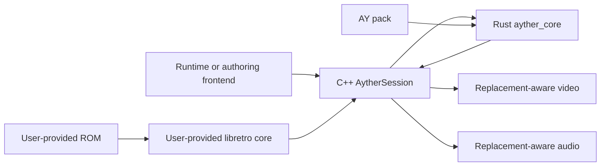

# Architecture

**Status:** buildable core and native engine; runtime verification incomplete

**Last reviewed:** 2026-08-27

AYTHER Engine observes the output and state of an emulated game, derives stable
identities from that observation, and resolves those identities to optional
replacement assets. It does not modify the source ROM and does not own product
distribution, authoring UI, or emulator-core distribution.

> [!WARNING]
> This is an early architecture. The Rust core and complete C++ target build and
> install, but renderer, audio, GPU, and emulator integration behavior is not
> yet covered by a release-grade test matrix.

## System context

The frontend owns user interaction and process lifecycle. The C++ layer
owns real-time orchestration and native multimedia integration. The Rust core
owns deterministic identity, substitution policy, content-pack semantics,
validation, scripting, and format-heavy operations.

## Component boundaries

| Component | State | Responsibilities |
|---|---|---|
| `ayther_core` | Implemented | identities, substitutions, pack VFS, validation, scripting, ROM patches, SoundFont processing, CXX declarations, flat C ABI |
| `Ayther::core` | Pre-release package | installed static archive and C header for native consumers |
| `Ayther::engine` | Buildable pre-release package | session facade, libretro host, Vulkan renderer, SDL audio, rewind/recording, component wiring |
| `Ayther::ymfm` / `Ayther::vpx` | Native dependencies | vendored FM target; optional installed VP9 target |
| Runtime, SDK, Play, Hub, Lab | External products | consumption, authoring, launch, distribution, or proprietary workflows |

Core and engine form one technical provider. Public consumers should enter
through the engine-owned facade; direct use of the broad core ABI remains an
expert, unstable integration path.

## Runtime data flow

1. A caller supplies a ROM, emulator core, configuration, and optional pack.
2. The emulator produces video, audio, and memory observations.
3. Identity modules normalize those observations into deterministic keys.
4. Conditions, profiles, and scripts provide bounded runtime context.
5. Substitutors resolve keys to pack assets or retain the original output.
6. The engine composites graphics, schedules audio, and presents the frame.

Failure to load or resolve optional replacement content should preserve original
emulator output where safe. Trust failures, incompatible schemas, invalid FFI
inputs, and required-resource failures must be explicit; they must not be
silently downgraded to successful activation.

## Core module map

| Area | Modules |
|---|---|
| Graphics identity | `tile_substitutor`, `sprite_hasher`, `vram_sprite`, `shape_hash`, `background`, `animation` |
| Audio identity and playback data | `audio_hasher`, `audio_event`, `instrument_map`, `sf2`, `sf2_bake`, `sf3`, `sfz` |
| Context and matching | `conditions`, `memory_aob`, `ram_anchor`, `game_profile`, `widescreen_gate` |
| Content packs | `archive_vfs`, `pack_builder`, `pack_validate`, `pack_credits`, `file_watcher` |
| Scripting and patches | `script_env`, `rom_patch`, `cheat_code` |
| Native boundaries | `ffi` for `cxx`; `lib` for the flat C ABI and crate facade |

## Trust boundaries

- Packs, scripts, ROMs, patches, emulator cores, and media are untrusted input.
- Raw pointers cross the flat C ABI; validation cannot make an invalid pointer
  safe. The caller owns pointer validity, alignment, lengths, and lifetimes.
- Lua executes in a reduced environment with an instruction limit, but it is
  still attacker-controlled computation and requires resource limits.
- A valid signature proves integrity relative to a trusted key; it does not
  grant content rights or establish that an emulator core is safe.
- Dynamic emulator-core loading belongs to the engine layer and requires an
  allowlisted, auditable policy before release.

## Architectural invariants

1. Deterministic input produces deterministic identity independent of asset
   presentation.
2. Content packs contain replacement material, never the game ROM or BIOS.
3. Patches apply in memory; the source ROM remains unchanged.
4. Core handles are single-threaded unless a type explicitly documents another
   contract.
5. Shared layouts use fixed-width fields and compile-time C++ assertions.
6. Optional enhancement failure never authorizes bypassing signature, schema,
   path, or bounds checks.

The accepted boundary rationale is recorded in
[ADR 0001](adr/0001-core-and-engine-component-boundary.md). Current maturity and
exceptions remain authoritative in [Project status](PROJECT_STATUS.md).
